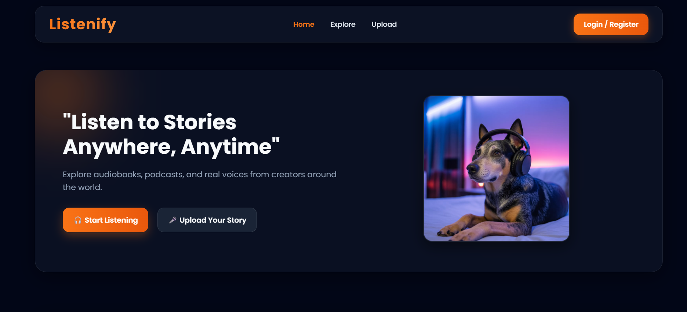
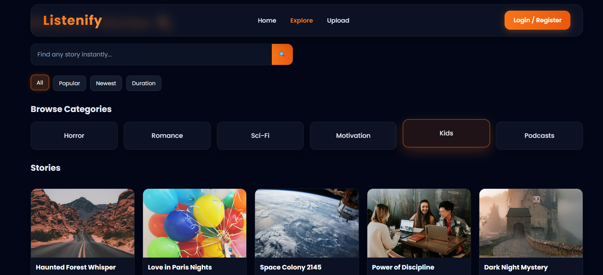
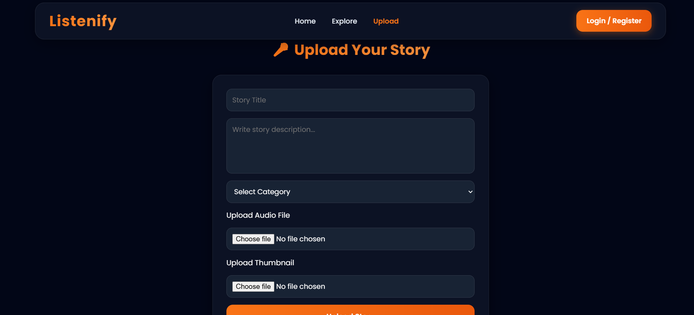
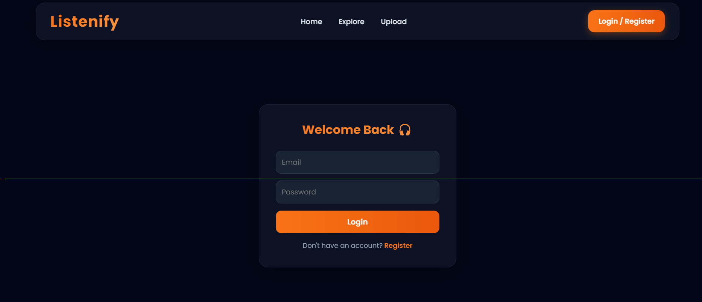

# 🎧 Audiobook Web App (React + Vite)

A modern audiobook / storytelling web application built using **React (Vite)**.  
Users can explore stories, filter by category, search content, and listen to audio stories with a smooth UI experience.

---

## 🚀 Features

### 🎧 Audio Experience
- Play audiobooks directly from story cards
- Central audio context for global playback control

### 🔍 Explore System
- Search stories by title (live filtering)
- Filter by:
  - Popular 🔥
  - Newest 🆕
  - Duration ⏱️
- Category-based browsing (Horror, Romance, Sci-Fi, Motivation, Kids, Podcasts)

### 👥 Creators Page
- Featured creators section on Home page
- Full Creators page with:
  - Creator profile detail view
  - Click-to-select creator
  - Creator list with active highlighting
  - Stories count, followers, category info

### 🎨 UI/UX
- Glassmorphism design
- Smooth hover animations
- Responsive layout (mobile + tablet + desktop)
- Modern dark theme with orange accent

---

## 📁 Project Structure

```
src/
├── components/
│   └── Navbar/
│
├── context/
│   └── AudioContext.jsx
│
├── data/
│   └── stories.js
│
├── pages/
│   ├── Home/
│   ├── Explore/
│   ├── Creators/
│   ├── Auth/
│   └── Upload/
│
├── assets/
└── App.jsx
```

## 🧠 Key Functionalities

### 🔎 Search Logic
- Searches only story titles (can be extended to description/category)

### 🎯 Filtering System
- Filters + Category selection are mutually controlled
- Sorting resets when category changes

### 👤 Creator Interaction
- Clicking a creator updates:
  - Left detail panel
  - Active highlight in list

---

## ⚙️ Tech Stack

- React.js ⚛️
- Vite ⚡
- CSS3 🎨
- React Router DOM 🧭
- Context API 🎧

---

## 🎮 Demo

Live Demo:
https://danu-codes.github.io/Listenify/

---

## 📸 Screenshots








---

## 🚀 Future Improvements

- 🔐 Authentication system
- ❤️ Like / Save stories
- 📱 Mobile app version
- ☁️ Backend integration (Node.js / Firebase)
- 🎙️ Creator upload dashboard

---

## 👨‍💻 Author

Built by **DANUSHAN**

---

## 📜 License

This project is open source and free to use.